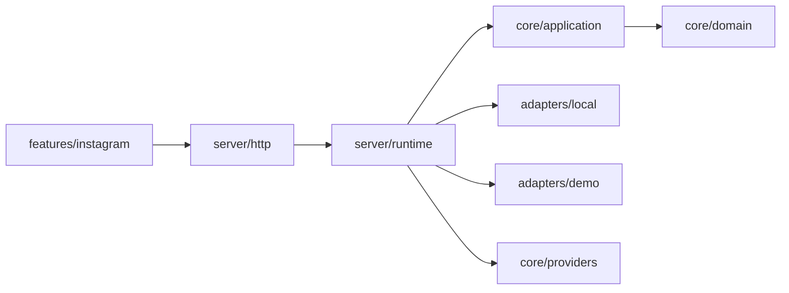

# Arquitetura e pontos de integração

O workspace separa distribuição do SDK e execução do aplicativo. O aplicativo depende do SDK; o SDK nunca depende do aplicativo. Schemas e regras de carrossel têm uma única fonte em `packages/core/src/domain/`.

| Quero substituir                 | Arquivo ou contrato                                                  |
| -------------------------------- | -------------------------------------------------------------------- |
| Login e organização ativa        | `apps/studio/lib/auth/server.ts` e `hooks/auth/AuthProvider.tsx`     |
| Nome, descrição, logo e cor      | `apps/studio/lib/instagram/brand.ts`                                 |
| Banco de itens                   | `StudioRepository`; exemplo em `server/adapters/local/repository.ts` |
| Arquivos privados                | `AssetStore`; exemplo em `server/adapters/local/assets.ts`           |
| Provedor de IA e orçamento       | `AiRequest`; composição em `server/runtime.ts`                       |
| API, permissões e conexão social | `server/http/handler.ts` e SDK `/social`                             |
| Idioma                           | `hooks/i18n/`                                                        |
| Composição visual                | `features/instagram/components/`; rotas somente compõem páginas      |

A persistência local usa fila no processo e rename atômico do JSON; atende uma instância local. Para múltiplas instâncias, substitua por banco com unicidade `(tenant_id,id)`, isolamento e storage privado. Os contratos de claim, recuperação e publicação estão em `integration.md`.

A API legada em `docs/legacy/` depende do CRM anterior e serve apenas para consulta. Ela não é compilada nem incluída no arquivo do SDK. O pacote distribuído contém `dist`, sua documentação e os avisos MIT; não contém telas, dados locais ou credenciais.
