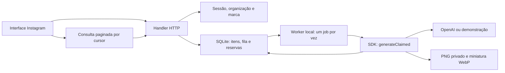

# Arquitetura e pontos de integração

O app depende do SDK; o SDK independe de Next.js e dos adapters do aplicativo. Schemas e regras de carrossel têm uma única fonte em `packages/core/src/domain/`. A organização do workspace mantém as telas originais em `features/instagram` e as rotas responsáveis apenas por compor páginas.

## Camadas

| Camada                              | Responsabilidade                                                                 |
| ----------------------------------- | -------------------------------------------------------------------------------- |
| `packages/core/src/domain`          | Validação, IDs, formatos finais, publicação e automações                         |
| `packages/core/src/application`     | Criação, idempotência, `StudioRepository`, `StudioReadRepository` e `AssetStore` |
| `packages/core/src/providers`       | Transports OpenAI/Zernio, normalização de recibos e erros sanitizados            |
| `apps/studio/features/instagram`    | Formulários, biblioteca, revisão, polling e ações explícitas                     |
| `apps/studio/server/http`           | Contexto por requisição, permissões, rotas exatas, métodos e erros HTTP          |
| `apps/studio/server/runtime.ts`     | Configuração, composição e execução do worker                                    |
| `apps/studio/server/adapters/local` | SQLite, quota, jobs persistentes, marca salva e imagens privadas                 |
| `apps/studio/server/adapters/demo`  | Artes simuladas com texto, sem chamada paga                                      |

## Contratos que você pode substituir

| Serviço                                    | Arquivo ou contrato                                                   |
| ------------------------------------------ | --------------------------------------------------------------------- |
| Login, organização ativa e papel           | `apps/studio/lib/auth/server.ts` e `hooks/auth/AuthProvider.tsx`      |
| Nome, contexto, logo e cor                 | `apps/studio/lib/instagram/brand.ts`                                  |
| Claim e finalização da geração             | `StudioRepository`                                                    |
| Leitura paginada, legenda e arquivamento   | `StudioReadRepository`                                                |
| Imagens privadas e formato final           | `AssetStore`; quarto argumento opcional de `save`                     |
| Fila, concorrência, recuperação e reservas | `server/adapters/local/repository.ts` e worker em `server/runtime.ts` |
| IA                                         | `AiRequest`, `createAi` e `openAiTransport`                           |
| Conexão social e permissões de publicação  | `server/http/handler.ts` e SDK `/social`                              |
| Idioma                                     | `apps/studio/hooks/i18n/`                                             |
| Composição visual                          | `apps/studio/features/instagram/components/`                          |

A API resolve sessão, tenant e marca uma vez por requisição e usa os adapters correspondentes. O exemplo de autenticação ainda retorna identidade fixa e restringe o acesso a loopback. Login real e OAuth não são fornecidos; substitua essa fronteira antes de hospedar.

## Persistência e execução

O adapter local usa `node:sqlite`, disponível a partir de Node 22.13 sem flag experimental. Dependendo da versão, o runtime emite aviso experimental. WAL, transações, índices por organização/ID/data e leitura por ID evitam ler e regravar toda a biblioteca em cada operação. `STUDIO_DATA_DIR` permite isolar dados de testes e selecionar disco persistente.

Enqueue insere intenções, jobs e reservas em uma transação. O POST responde 202 para geração; o navegador consulta estados. Um carrossel registra os oito slides de uma vez. Jobs aguardando sobrevivem ao restart; o worker é iniciado pela atividade do servidor e processa um job de cada vez. Jobs em execução por mais de dez minutos viram falha para inspeção, sem retry pago automático.

O limite padrão é 20 novos jobs por organização por dia UTC. Orçamento opcional usa uma estimativa configurada por job, sem alegar medição de cobrança real. Retry explicitamente solicitado cria novo UUID e arquiva a intenção anterior de forma atômica.

Imagens passam por recorte para o formato final e geração de miniatura WebP. Diretórios derivados do hash do tenant evitam usar seu identificador como caminho. Arquivos são gravados com sincronização e rename; a API só os serve após resolver a organização e o item. Arquivamento não apaga fisicamente registros ou assets.

A migração valida todo o JSON legado, preserva uma cópia `items.pre-sqlite.json` e importa em transação. JSON inválido interrompe a abertura para recuperação. SQLite e worker local atendem uma instalação em disco persistente: múltiplas instâncias e serverless exigem banco/storage e fila da infraestrutura anfitriã.

## Interface e verificações

O Tailwind inclui explicitamente `features/`, mantendo os estilos das telas. Fontes são arquivos locais. Testes isolam dados, exercitam API e fluxo de criação no navegador e verificam estilos computados para detectar regressões de layout. Providers sociais e IA são testados com transport simulado; testes não comprovam publicação, entrega de Direct ou geração paga real.

`npm run verify` combina lint, formatação, testes, tipos, build e verificação do aplicativo. Cabeçalhos de segurança e política de conteúdo são definidos no app; adapte origens e permissões ao integrar serviços externos.

## Distribuição

O app depende de `file:../../packages/core`. Para distribuí-lo isoladamente, preserve a estrutura relativa ou instale o tarball do SDK e ajuste a dependência. O pacote npm ainda não está publicado; `npm run pack:core` gera `saraivabr-instagram-studio-kit-0.2.0.tgz`.

O SDK contém `dist`, sua documentação e avisos MIT. Telas, dados locais, credenciais e `docs/legacy` ficam fora do pacote. O código legado depende do CRM anterior e é referência, sem compilação.

Veja o [guia de integração](integration.md) para contratos, recuperação e os serviços que permanecem a cargo do produto anfitrião.
